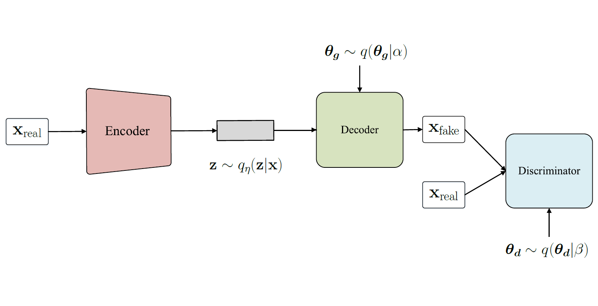

# Variational Bayesian GAN for Mixtures-of-Gaussian
To test the ability to infer a multi-modal posterior which helps avoiding the mode collapse, an instance of over-fitting in regular GAN training. We generate 2-dimensional synthetic data by mixtures of 8 Gaussian distribution scattered equality on circumference. We run the synthetic data on our proposed, vanilla GAN and Bayesian GAN, showing 100 samples from the models every 10000 iterations and find out that our proposed and Bayesian GAN are more powerful to capture the modes of mixtures of Gaussian avoiding the mode collapse.

  
  

## Setting
- Framework:
    - Pytorch 0.4.0
- Hardware:
	- CPU: Intel Core i7-2600 @3.40 GHz
	- RAM: 20 GB DDR4-2400
	- GPU: GeForce GTX 980

## Result of sampling
|  |
| :------------------------------------------------: |
| VBGAN                                   |

|  |
| :--------------------------------------------------: |
| VBGAN_w                                           |

## Test accuracy
|  |
| :-----------------------------------------: |
| Test accuracy of our proposed and Bayesian GAN  |

